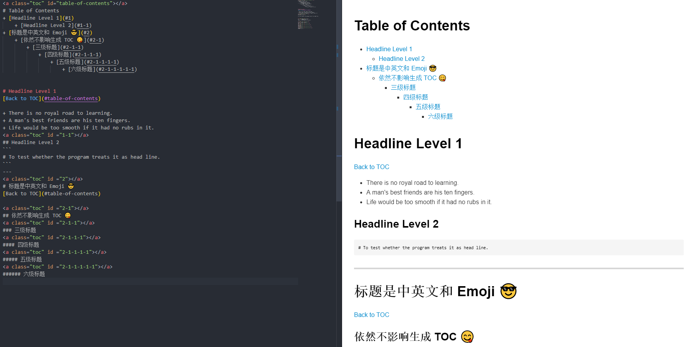
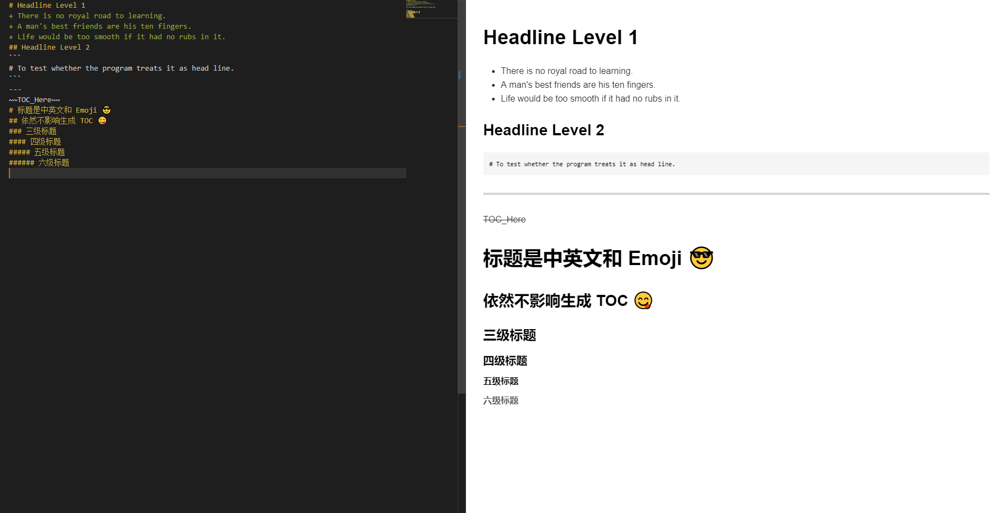

# Generate Markdown TOC
Since GitHub cannot automatically generate TOC using the TOC command, Inspired by [Markdown toclify](https://github.com/rasbt/markdown-toclify), I write a script that could help you generate TOC in your file， Even the head line with Chinese and Emoji.

# Requirement
+ Python 3.6+ (Since I like f-strings)
+ argparse

# Usage
## Generate_TOC
You can use comman like that:
```bash
$  python src\Generate_TOC.py -h
usage: Generate_TOC.py [-h] [-o [output filename]] [-p [placeholder]]
                       [-b [Back to TOC string]]
                       input filename

Generate TOC for your Markdown file.

positional arguments:
  input filename        The file that need to generate TOC. You must spacify
                        the input filename.

optional arguments:
  -h, --help            show this help message and exit
  -o [output filename], --output [output filename]
                        The newly generated file with TOC from the original
                        file. If the parameter is omitted, The original file
                        will be overwritten with the newly generated file.
                        NOTE: output_filename=input_filename in default.
  -p [placeholder], --placeholder [placeholder]
                        Specify the placeholder, and it will generate TOC at
                        the position of placeholder, otherwise the TOC will
                        generate at the top. NOTE:
                        placeholder="~~placeholder~~" in default.
  -b [Back to TOC string], --back_to_toc [Back to TOC string]
                        Specify the "back to TOC" anchor under the First level
                        heading.

```
You can specify the `input filename` to generate the TOC, as well as the `output filename`
**Note**: If you do not specify `output_filename`, it overwrites the input file by default.
And if you want to generate TOC wherever you want, you can add a line `~~placeholder~~` in your markdown file. Besides, you can add some `Customized placeholder`, but you must spacify the placeholder at the command line, for example:
```bash
  $  python src\Generate_TOC.py input.md -o output.md -p ~~TOC_Here~~
```
Moreover, you can specify the `back to toc` (argument `-b`) anchor which will be added below the first level title (default `"Back to TOC"`).
## Recovery
You can use comman like that:
```bash
$  python .\src\Recover.py -h
usage: Recover.py [-h] [-b [Back to TOC string]] recovery filename

Recover your Markdown file with TOC (generated by Generate_TOC.py).

positional arguments:
  recovery filename     The file that need to recover.

optional arguments:
  -h, --help            show this help message and exit
  -b [Back to TOC string], --back_to_toc [Back to TOC string]
                        Specify the "back to TOC" anchor under the First level
                        heading, so as to move from.

```
You can specify the file name you want to recover, and remove the TOC from it to recover to the original file, and the `back to toc` anchor (argument `-b`) which will be removed by specifying the `Back to TOC string` (default `"Back to TOC"`).
**Note**: Before using the script, it would be better to ensure that the file is generated by `Generate_TOC.py`, otherwise something wrong would be happen.

# Generate TOC at the top (Default)
## Input File

## Output File
```bash
$  python src\Generate_TOC.py input.md -o output.md
### Generating markdown toc from ..\input.md, and wtite back to ..\output.md...
### Already generating markdown toc
```

# Generate TOC anywhere (Customized)
You can add a line `~~placeholder~~` at your markdown file, at which the TOC will generate.
Besides, you can add some `Customized placeholder`, but you must spacify the placeholder at the command line, for example:
```bash
  $  python src\Generate_TOC.py input.md -o output.md -p ~~TOC_Here~~
```
## Input File

## Output File
```bash
$  python src\Generate_TOC.py input.md -o output.md
### Generating markdown toc from input.md, and wtite back to output.md...
### Already generated markdown TOC for input.md.
```


# Generate TOC With Specified "Back to TOC"
## With "Back to TOC" (Default)
```bash
$  python src\Generate_TOC.py input.md -o output.md
```
## Without "Back to TOC"
```bash
$  python src\Generate_TOC.py input.md -o output.md -b 
```
## With "Back"
```bash
$  python src\Generate_TOC.py input.md -o output.md -b Back
```
# Recovery
```bash
$  python src\Recover.py output.md
### Recover from file: README.md [Y/N]
y
### Recovery done
```


